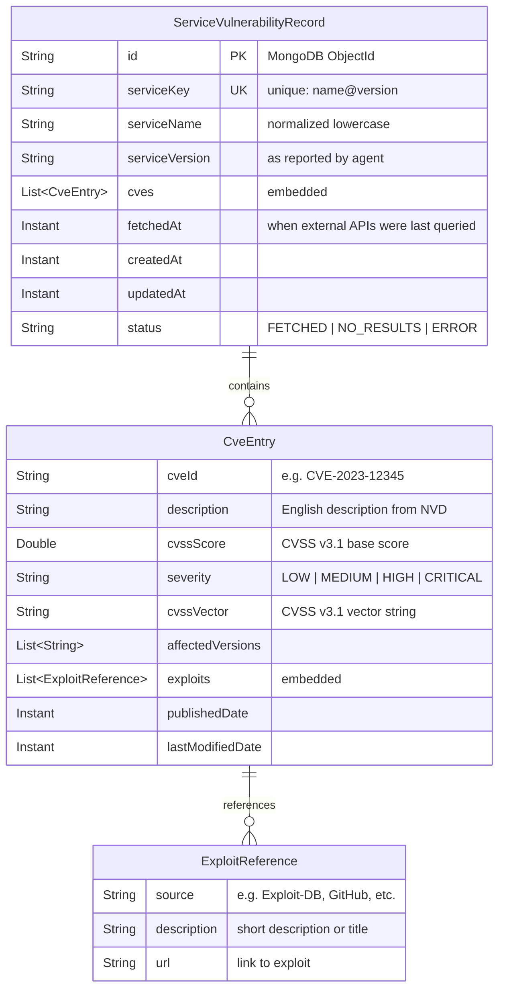
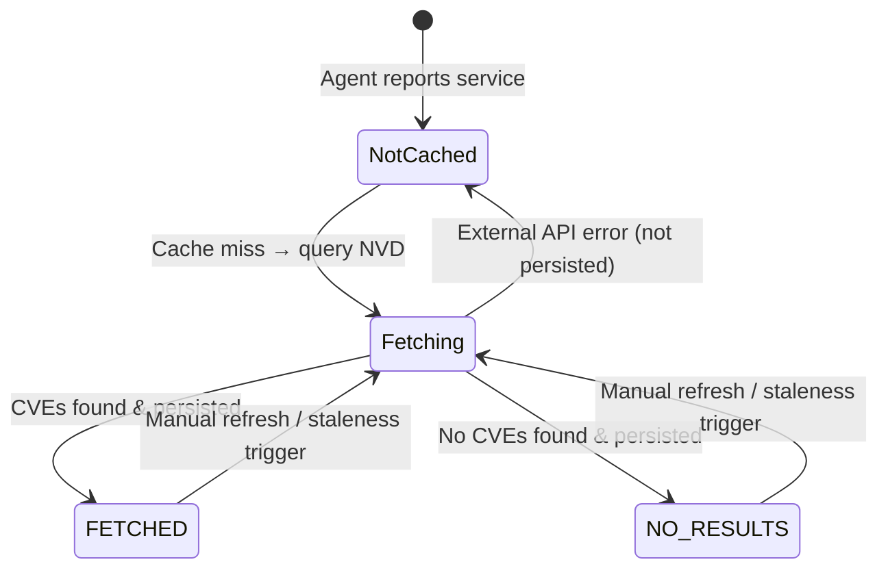

# Data Model: Vulnerability & Exploit Lazy Lookup

**Date**: 2026-04-25  
**Feature**: [spec.md](./spec.md) | **Research**: [research.md](./research.md)

## Entity Overview

## Entity Details

### ServiceVulnerabilityRecord (MongoDB Collection: `service_vulnerabilities`)

This is the primary cache entity. One document per unique service+version combination.

| Field | Type | Constraints | Description |
|-------|------|-------------|-------------|
| `id` | `String` | PK (MongoDB ObjectId) | Auto-generated document ID |
| `serviceKey` | `String` | **Unique index** | Normalized key: `{serviceName}@{serviceVersion}` (e.g., `openssh@8.9p1`) |
| `serviceName` | `String` | Not null, lowercase | Normalized service name as reported by agent |
| `serviceVersion` | `String` | Not null | Version string as reported by agent |
| `cves` | `List<CveEntry>` | Embedded | List of CVEs associated with this service+version |
| `fetchedAt` | `Instant` | Not null | Timestamp of when external APIs were last queried |
| `status` | `String` (enum) | Not null | `FETCHED` = successful lookup, `NO_RESULTS` = no CVEs found, `ERROR` = lookup failed (not persisted) |
| `cpeNameUsed` | `String` | Nullable | The CPE name resolved and used for NVD query (for debugging/audit) |
| `totalCves` | `int` | Not null | Count of CVEs for quick access without deserializing list |
| `createdAt` | `Instant` | Not null | Document creation timestamp |
| `updatedAt` | `Instant` | Not null | Last update timestamp |

**Note**: This entity does NOT extend `ScopedEntity` or `BaseEntity`. It is a global cache shared across all organizations and projects — vulnerability data for "openssh@8.9p1" is the same regardless of which organization's agent reported it.

**Indexes**:
- `serviceKey` — unique index (primary lookup)
- `serviceName` — non-unique index (for dashboard queries filtering by service name)
- `fetchedAt` — non-unique index (for staleness queries)

### CveEntry (Embedded Document)

| Field | Type | Constraints | Description |
|-------|------|-------------|-------------|
| `cveId` | `String` | Not null | CVE identifier (e.g., `CVE-2023-12345`) |
| `description` | `String` | Not null | English description from NVD |
| `cvssScore` | `Double` | Nullable | CVSS v3.1 base score (0.0–10.0) |
| `severity` | `String` | Nullable | Qualitative severity: `LOW`, `MEDIUM`, `HIGH`, `CRITICAL` |
| `cvssVector` | `String` | Nullable | CVSS v3.1 vector string |
| `affectedVersions` | `List<String>` | Optional | Version ranges affected (extracted from CPE configurations) |
| `exploits` | `List<ExploitReference>` | Embedded | Known exploits for this CVE |
| `publishedDate` | `Instant` | Nullable | CVE publication date |
| `lastModifiedDate` | `Instant` | Nullable | CVE last modification date |

### ExploitReference (Embedded Document)

| Field | Type | Constraints | Description |
|-------|------|-------------|-------------|
| `source` | `String` | Not null | Source name (e.g., `Exploit-DB`, `GitHub`, `Packet Storm`) |
| `description` | `String` | Nullable | Short description or title of the exploit |
| `url` | `String` | Not null | URL link to the exploit |

## State Transitions

## Validation Rules

1. **serviceKey**: must match pattern `^[a-z0-9._-]+@[a-zA-Z0-9._-]+$`
2. **serviceName**: must be lowercase, non-empty, max 256 chars
3. **serviceVersion**: non-empty, max 128 chars
4. **cveId**: must match pattern `^CVE-\d{4}-\d{4,}$`
5. **cvssScore**: must be between 0.0 and 10.0 if present
6. **severity**: must be one of `LOW`, `MEDIUM`, `HIGH`, `CRITICAL` if present
