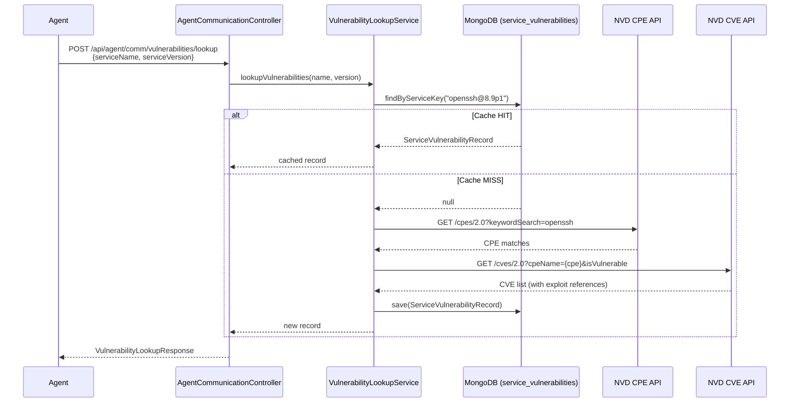

# Quickstart: Vulnerability & Exploit Lazy Lookup

**Date**: 2026-04-25  
**Feature**: [spec.md](./spec.md)

## Overview

This feature adds a vulnerability and exploit lookup system to the central platform using a lazy-loading cache strategy. When agents report discovered services, the platform checks its local MongoDB cache, queries external APIs (NVD/NIST) on cache miss, persists results, and returns enriched security intelligence to the agent.

## Architecture Flow



## Components to Build

### API Module (`api/`)

1. **Domain: `vulnerability`** — new domain package
   - `model/ServiceVulnerabilityRecord.java` — MongoDB document entity
   - `model/CveEntry.java` — embedded CVE data
   - `model/ExploitReference.java` — embedded exploit reference
   - `model/VulnerabilityStatus.java` — enum (FETCHED, NO_RESULTS)
   - `model/dto/VulnerabilityLookupRequest.java` — agent request DTO
   - `model/dto/VulnerabilityLookupResponse.java` — response DTO
   - `model/dto/VulnerabilityListItem.java` — summary DTO for dashboard list
   - `db/ServiceVulnerabilityRepository.java` — Spring Data MongoDB repository
   - `services/VulnerabilityLookupService.java` — interface
   - `services/NvdApiClient.java` — interface for NVD API calls
   - `services/impl/VulnerabilityLookupServiceImpl.java` — core business logic
   - `services/impl/NvdApiClientImpl.java` — NVD API integration (CPE + CVE)
   - `services/VulnerabilityMapper.java` — entity ↔ DTO mapping
   - `exception/VulnerabilityException.java` — domain exception
   - `controller/VulnerabilityController.java` — dashboard REST endpoints

2. **Agent Communication Update**
   - `AgentCommunicationController.java` — add `POST /vulnerabilities/lookup` endpoint
   - `AgentCommunicationService.java` — add vulnerability lookup method

3. **Configuration**
   - `application.properties` — NVD API key, staleness threshold, rate limit settings
   - `CommonConfig.java` or new config — `RestTemplate` / `WebClient` bean for NVD API calls

### UI Module (`ui/`)

4. **Pages: `vulnerabilities`** — new page module
   - `data-access/vulnerabilities.service.ts` — HTTP service
   - `data-access/vulnerabilities.model.ts` — TypeScript interfaces
   - `feature/vulnerabilities.component.ts` — list view with table
   - `feature/vulnerability-detail/vulnerability-detail.component.ts` — detail view
   - `vulnerabilities.routes.ts` — route definitions
   - Register in `app-routing.module.ts` and `menu.component.ts`

## Configuration Required

```properties
# application.properties additions
nvd.api.key=${NVD_API_KEY:}
nvd.api.base-url=https://services.nvd.nist.gov/rest/json
nvd.api.rate-limit.requests-per-window=5
nvd.api.rate-limit.window-seconds=30
vulnerability.cache.staleness-days=${VULN_CACHE_STALENESS_DAYS:30}
```

## Verification Plan

1. **Unit tests**: `VulnerabilityLookupServiceImpl` with mocked `NvdApiClient` and repository
2. **Integration test**: Full flow with embedded MongoDB, mocked NVD responses
3. **Manual test**: Start API, call lookup endpoint via curl, verify cache behavior
4. **UI test**: Navigate to vulnerabilities page, verify table renders with sample data
